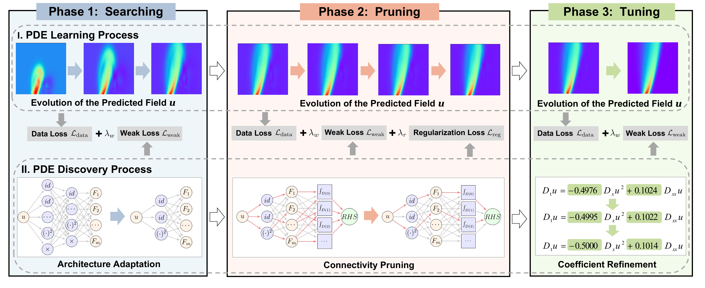

# Weak-PDE-Net

We propose Weak-PDE-Net, an end-to-end differentiable framework that can
robustly identify open-form PDEs.



## Getting Started

### Installation

Clone the repository, create a virtual
environment, and install the required packages:

```bash
git clone https://github.com/XinxinLi-Code/Weak-PDE-Net.git
cd Weak-PDE-Net

python3 -m venv .venv
source .venv/bin/activate
python -m pip install --upgrade pip
python -m pip install -r requirement.txt
```

For GPU training, install the PyTorch build compatible with the CUDA version on
your machine. See the official PyTorch installation instructions before
installing the remaining packages from `requirement.txt`.

### Data Preparation

The `datasets/` directory already contains the main benchmark data. These files
can be used directly without regeneration.

#### Complex Ginzburg-Landau equation

Generate the default 1D cubic complex Ginzburg-Landau data with:

```bash
python datasets/generate_cgle_data.py
```

The command creates:

- `datasets/CGLE.mat`: the generated complex-valued solution and its real and
  imaginary components.
- `datasets/cgle_data_preview.png`: a preview of the generated fields.

#### 3D wave equation

Generate the default analytic 3D wave data with:

```bash
python datasets/generate_wave3d_data.py
```

The command creates:

- `datasets/Wave3D_Analytic.npz`: the compressed reference dataset.
- `datasets/Wave3D_Analytic.mat`: an optional MATLAB copy.
- `datasets/sampling_idx/`: reproducible training subsets containing 5,000,
  10,000, and 20,000 indices by default.
- `datasets/wave3d_dataset_summary.json`: generation settings and validation
  statistics.

```bash
python datasets/generate_cgle_data.py --help
python datasets/generate_wave3d_data.py --help
```

### PDE Discovery

Each benchmark has an entry script in its corresponding `pde_mains` directory.
The general workflow is:

```bash
cd pde_mains
python -u pde.py
```

Replace `pde_mains` and `pde.py` with the directory and script for the equation
of interest. For example, run the Burgers experiment with:

```bash
cd burgers_mains
python -u burgers.py
```

The available entry points are:

| Equation | Directory | Script |
| --- | --- | --- |
| Burgers | `burgers_mains` | `burgers.py` |
| 2D Wave | `Wave_2d_mains` | `wave.py` |
| 3D Wave | `Wave_3d_mains` | `wave3d.py` |
| Sine-Gordon | `SG_mains` | `sg.py` |
| Complex Ginzburg-Landau | `CGLE_mains` | `cgle.py` |

Use `--sample_ratio` and `--sigma_NR` to specify the sampling ratio and noise
level. For example:

```bash
python -u pde.py --sample_ratio 0.25 --sigma_NR 0.05
```

An exact number of sampling points can be specified instead of a ratio:

```bash
python -u pde.py --sample_points 10000 --sigma_NR 0.0
```

`--sample_points` overrides `--sample_ratio` when both are provided. The entry
script loads the data, constructs the requested sample, adds noise when needed,
and runs the complete discovery pipeline:

1. **Searching** selects the symbolic network architecture and candidate terms.
2. **Pruning** removes insignificant terms and produces a sparse equation.
3. **Tuning** refines the retained coefficients and returns the final equation.

## Examples

We provide three notebooks for quick reproduction and result presentation:

- `1D_example.ipynb`: Burgers equation example.
- `2D_example.ipynb`: two-dimensional Wave equation example.
- `3D_example.ipynb`: three-dimensional Wave equation example.

Run a notebook interactively, or execute it from the repository root while
saving all outputs into the same file:

```bash
jupyter nbconvert --to notebook --execute --inplace 1D_example.ipynb \
  --ExecutePreprocessor.timeout=-1
```

The notebooks retain representative Searching, Pruning, and Tuning results,
the final discovered equation, and the test loss. The 1D and 2D
examples also present the reconstructed field, while the 3D example reports
text results only.
